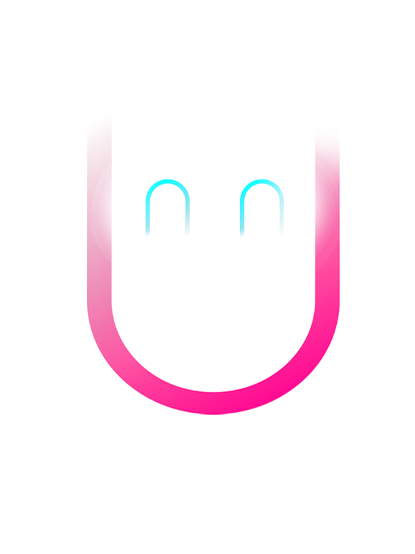

  <h2> Tech Stack & Tools </h2>

  <!-- Languages -->
  
  
  
  
  <!-- Front-End -->
  
  
  
  
  <!-- Back-End & Database -->
  
  
  
  
  <!-- Tools / Software -->
  
  
  
  
  
  

<!-- GitHub stats badges -->

  

<!-- Profile views counter -->

  

<!-- Add your personal content here -->

  <!-- Add your personal introduction, projects, experience, etc. -->

<!-- Add your logo image at the end -->

  

